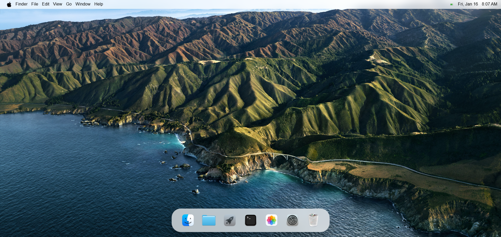
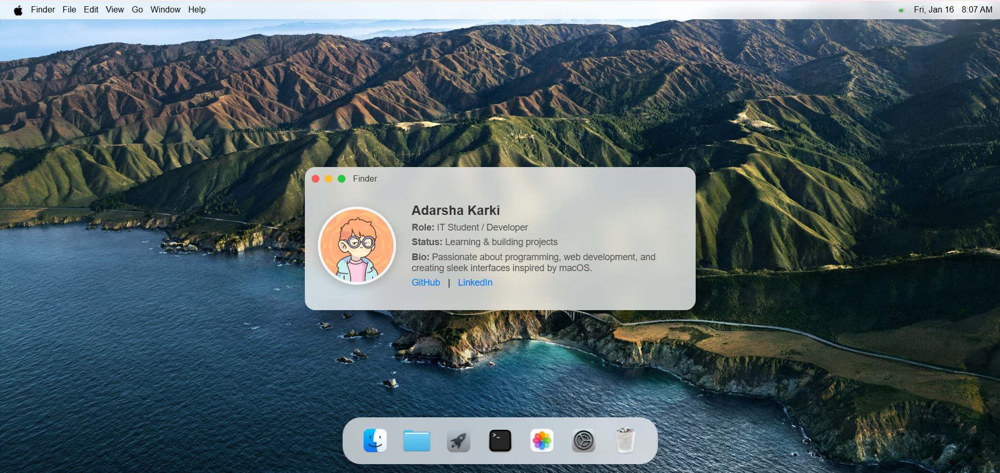
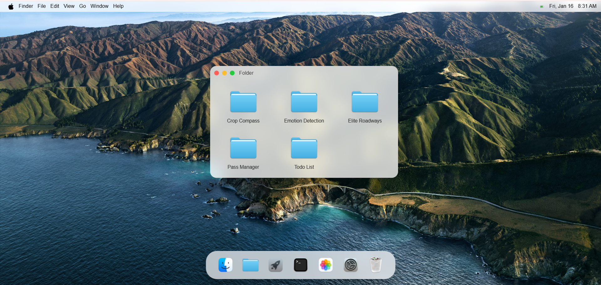
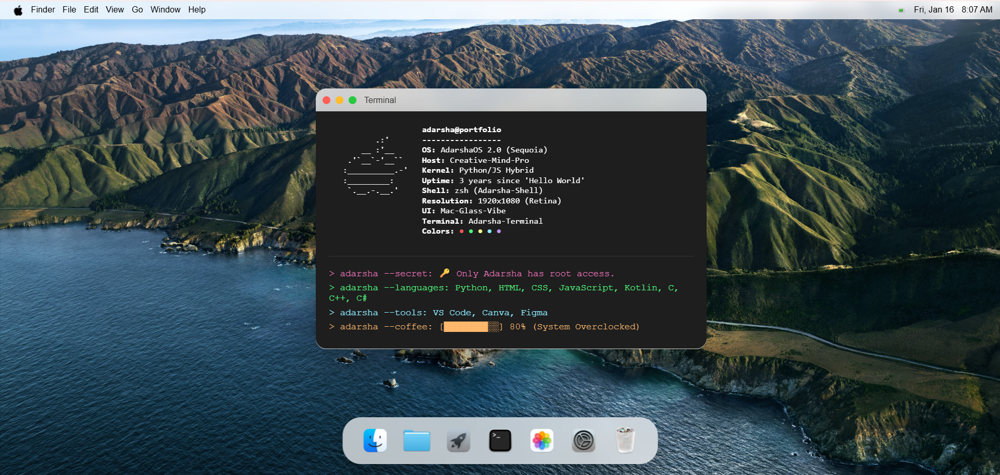
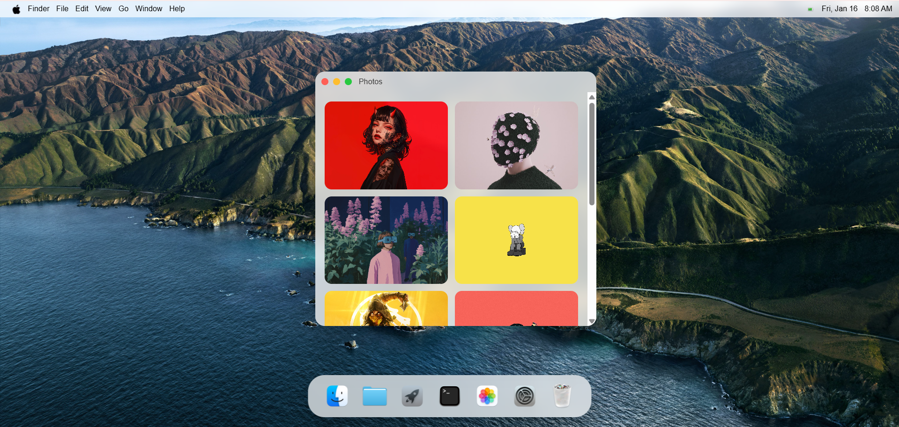
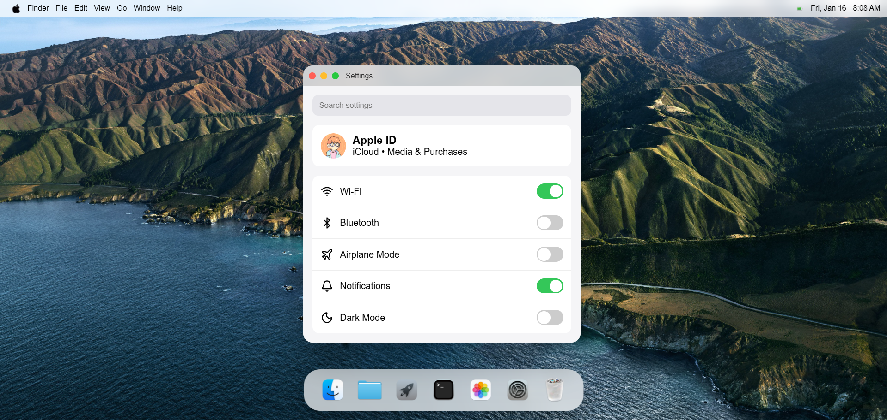

## Adarsha Karki – macOS-Style Personal Website
A macOS-inspired interactive personal website built with HTML, CSS, and JavaScript. The site mimics the macOS desktop interface, including a dock, draggable windows, app-like popups, and custom cursors, while showcasing my portfolio, projects, and personal information.

This project is inspired by [Samidy](https://samidy.com/)

### Features
* Desktop & System
* Fully interactive desktop with macOS-style menu bar and dock.
* Dynamic time and date with AM/PM format.
* Click ripple effect on mouse clicks.
* Custom mouse cursors for pointer, text, and move actions.

### Apps
1. **Finder (About Me)**
* Displays personal information in a macOS “System Info” style.
* Rounded profile image with details like bio, social links, and status.

2. **Folder (Projects)**
* Shows selected GitHub projects in a macOS folder style.
* Click on a project to open its GitHub repository in a new tab.
* Supports multiple projects like Crop Compass, Emotion Detection, Elite Roadways, Pass Manager, TodoList.

3. **Launchpad (Games / Demos)**
* Full-screen grid of game icons.
* Click to open GitHub repositories for games like Impossible TicTacToe, TicTacToe, Tetris, Flappy Bird, Classic Snake.
* Hover animation with bounce effect.

4. **Terminal (Tech Stack)**
* Displays programming languages and tools in a CLI-style window.

5. **Photos (Gallery)**
* Scrollable grid of personal images.
* Dynamic loading of images from the photos/images/ folder.

6. **System Settings (Contact & Info)**
* macOS/iOS-style settings window.
* Fake search bar, animated switches, and SVG placeholder icons.
* Displays contact info and placeholders.

7. **Trash**
* It's empty like my brain.

### Screenshots
1. **HomePage**

2. **Finder**

3. **Folder**

4. **Launchpad**

5. **Terminal**

6. **Photos**

7. **Settings**

8. **Trash**

### Future Improvements
* **Interactive settings:** Make switches functional and connect to user preferences.
* **Dynamic projects:** Load GitHub projects automatically using GitHub API.
* **Theme options:** Dark mode, custom wallpapers, and personalization.
* **Mobile optimization:** Responsive design for tablets and phones.
* **Advanced animations:** Improve window transitions, icon bounces, and hover effects.
* **Real apps:** Replace placeholder content with actual interactive mini-apps (calculator, notes, etc.).
* **Search functionality:** Implement a working desktop search bar for apps and files.
* **Improved drag/drop:** Allow multiple windows to be stacked and snapped.

### **Visit my [Portfolio](http://adarshakarki.com.np/)**
